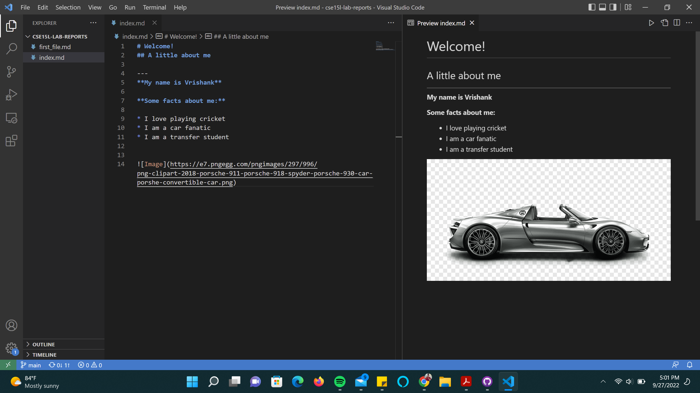

In Week 0's lab, I learned how to make my own webpage using github, how to create and edit files online and offline on github desktop and VSCode, and how to push those changes to my online repository. I also learned how to use ***Markdown***.

[Lab Report 1](https://kmags1.github.io/cse15l-lab-reports/lab-report-1-week-0.html)