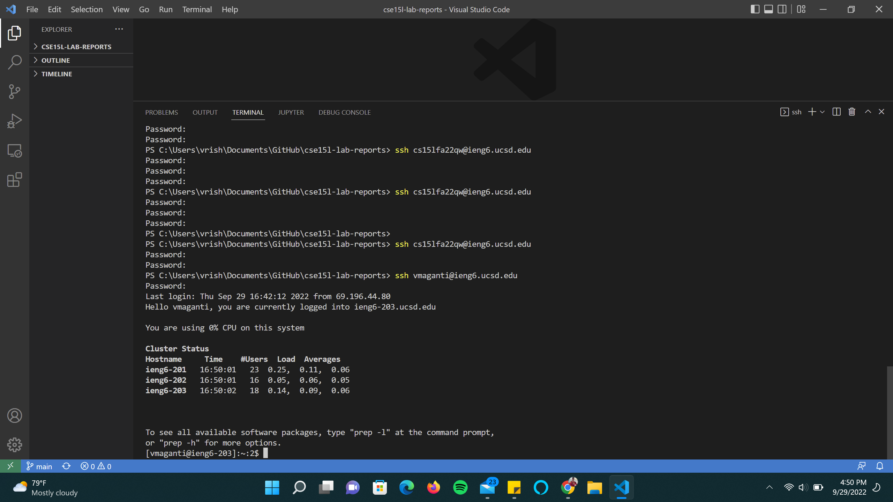
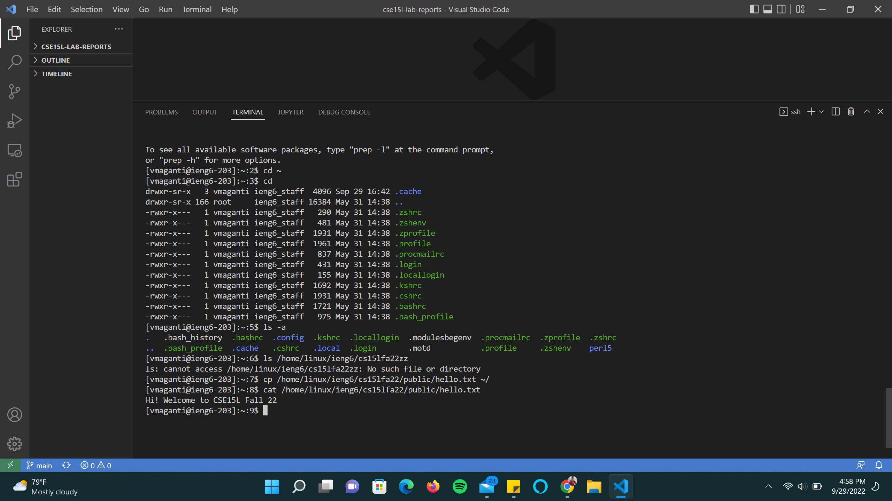
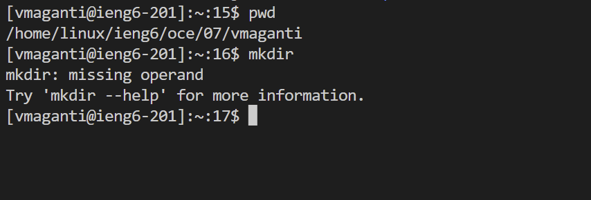
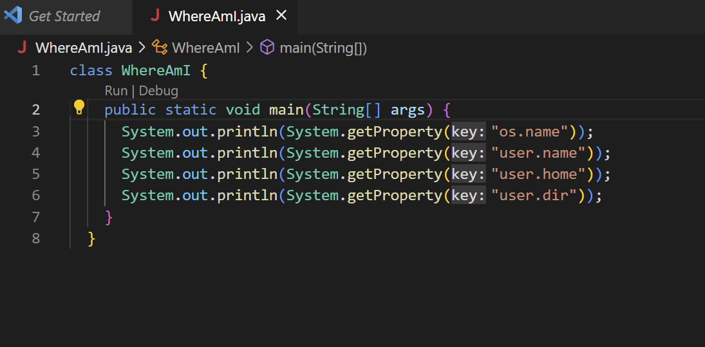
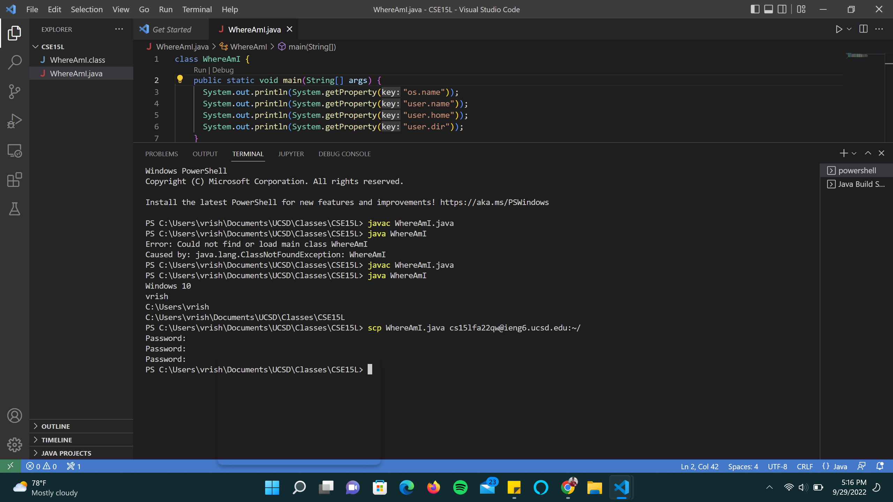
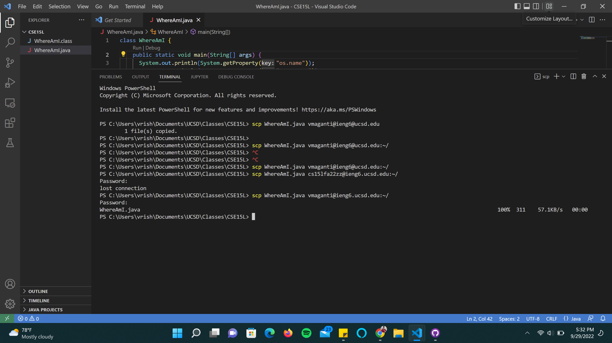
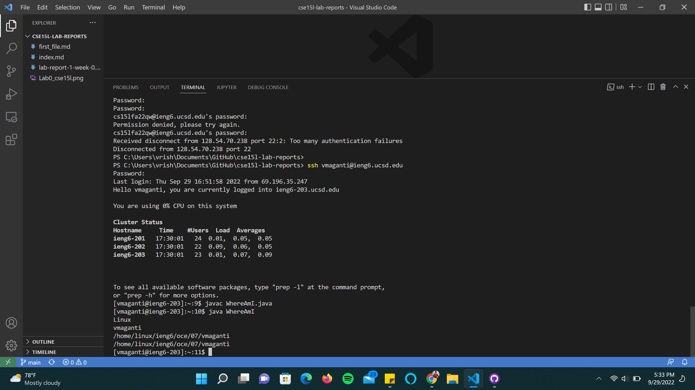
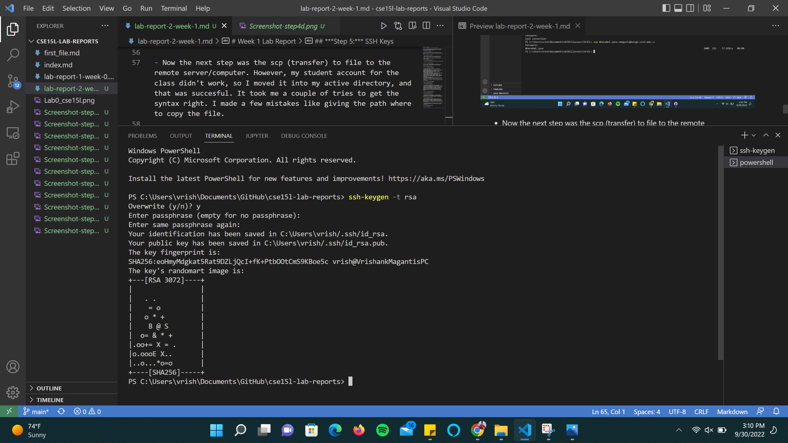
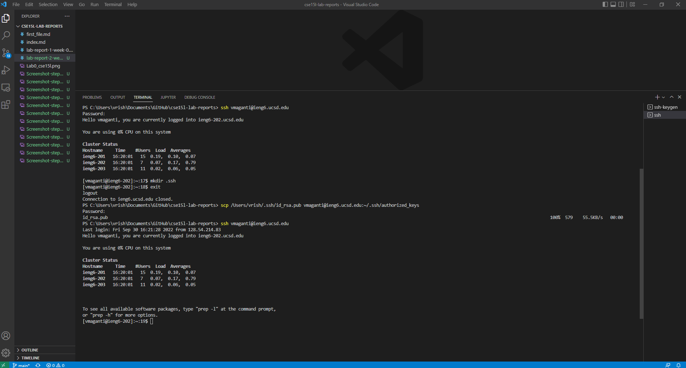
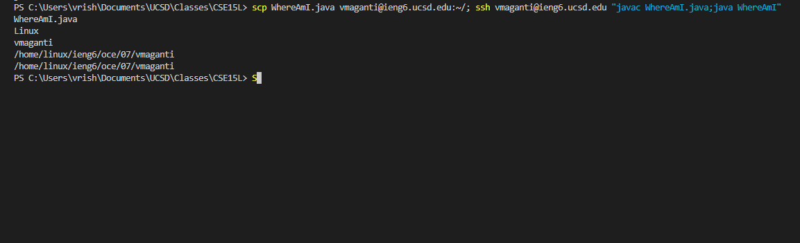

# Week 1 Lab Report 
## Tutorial: Logging into course-specific account 

**Note:** I was unable to get my ssh login to work even hours after resetting my password. The following steps have been completed with my active directory.

***Pre-Step:*** Logging in
-
- To log in to your student account, you need to find your student username using [Link](https://sdacs.ucsd.edu/~icc/index.php)


- Once you log in, You will find your username at the top or either a little below with all your associated accounts.
 
- Reset you password if you need to using the same the link found on the page.


- You now have your username and password for your account ready


***Step 1:*** Installing VSCode
- 
- I didn't have to download VSCode as I already had it from before. It looks the exact same each time I open VSCode.


***Step 2:*** Remotely Connecting
- 
- I didn't have to download OpenSSH as I already had it installed on my laptop.
- I use Windows, and my laptop has some optional features like OpenSSH and OpenClient that I can download straight from settings. To take advtange of this, go to Settings->Apps->Optional Features to download OpenSSH.

- Now that laptop had all the required software, I was ready to login using SSH. First I opened a terminal in VSCode by  clicking Terminal->New Terminal in the Titlebar.
- I was now ready to log into my student account. Using the username that in the pre-step. However, I couldn't get into my account as my passowrd kept failing each time even after resetting it.

- It asked me if I wanted to continue connecting add I typed 'yes'. Then I was prompted to type the password I set in the pre-step.
- Once I was in, the message looked like the message printed in the image above.

***Step 3:*** Running some commands
- 




- I ran the basic commands given in the lab document. It was pretty simple, no surpirses as to how things worked.
- Some of the basic commands are ls, which lists the files in a directory, cd, which changes directory, pwd, which prints the current directory the terminal is in, mkdir, which makes a directory, cat, which prints the contents of a file, and finally cp is the ccopy command. In the example below, cp copies the hello.txt file from public directory to the home directory.

***Step 4:*** Moving Files with scp
-




- As mentioned in the lab document, I created WhereAmI java file and wrote the code displayed above, and compilied it. getProperty gets the information requested in the paranthesis.



- Now the next step was the scp (transfer) to file to the remote server/computer. However, my student account for the class didn't work, so I moved it into my active directory, and that was succesful. It took me a couple of tries to get the syntax right. I made a few mistakes like giving the path where to copy the file.

- I ran the WhereAmI file on the server now, and it worked just as expected; The properties are different hence the output looks different.



***Step 5:*** SSH Keys
- 
- The next step was to create a ssh key to make the transfer, compiling and running of files much easier. 
- Running the ssn-keygen is a little different on windows. I needed to specify the folder I wanted the Key to be saved in in the ssh-keygen command. The rest of the steps looked exactly like how it would work on any device.



- Then I put the public key in the remote server and tried to log in, and it worked as intended.



***Step 6:*** Optimize Remote Running
-
- After trying the commands given in the lab report (given below), I found that the the combination of the first and second command might be something I need to come up with to make remote running easier.

```
$ ssh cs15lfa22@ieng6.ucsd.edu "ls"
$ cp WhereAmI.java OtherMain.java; javac OtherMain.java; java WhereAmI
```
- However, the second command didn't work for me. I kept getting errors I couldn't resolve. Then I figured out that I was running those commands from the class my repo, which is the wrong folder to run the command. Then I ran it from the folder I had saved WhereAmI.java on  my computer.

- This command is kind of long, but it does all the steps in one command.



- The command is: scp WhereAmI.java vmaganti@ieng6.ucsd.edu:~/; ssh vmaganti@ieng6.ucsd.edu "javac WhereAmI.java;java WhereAmI"
