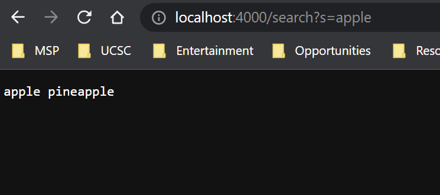

# Week 3 Lab Report 

## Part 1:

- handleRequest is the method being called iin SearchEngine
- The argument to the method is localhost:4000/add?s=anewstringtoadd. The values of the field (items) when this method is called is NULL.
- The values of the field (items) after this is anewstringtoadd, because this string is added to the field.

- handleRequest is the method being called iin SearchEngine
- The argument to the method is localhost:4000/. The values of the field (items) when this method is called is anewstring.
- The values of the field (items) after this is anewstring, so it hasn't changed.

- handleRequest is the method being called iin SearchEngine
- The argument to the method is localhost:4000/search?s=apple. The values of the field (items) when this mehtod is apple, pineapple and anewstringtoadd.
- The values of the field (items) after this is apple, pineapple and anewstring, so it hasn't changed.

## Part 2:

- The returned array needed to be reversed, basically swapped, but as it can be seen in the symptoms, it was not reversed. The bug was that the second half of the array was being copied to the first half in order, but when it was updated, the first half of the array was lost, so the new values that were copied into the first half are also copied into the second half, which basically means that the second half was never changed. I fixed that by swappinhg the values the values until the middle of the array was reached.

- The returned list needed to add the strings that had a length greater than 1 in the exact order. However, the bug is that the code was adding in reverse order. I fixed it by changing add(0, element) to add(element) which makes sure the string are added in order.