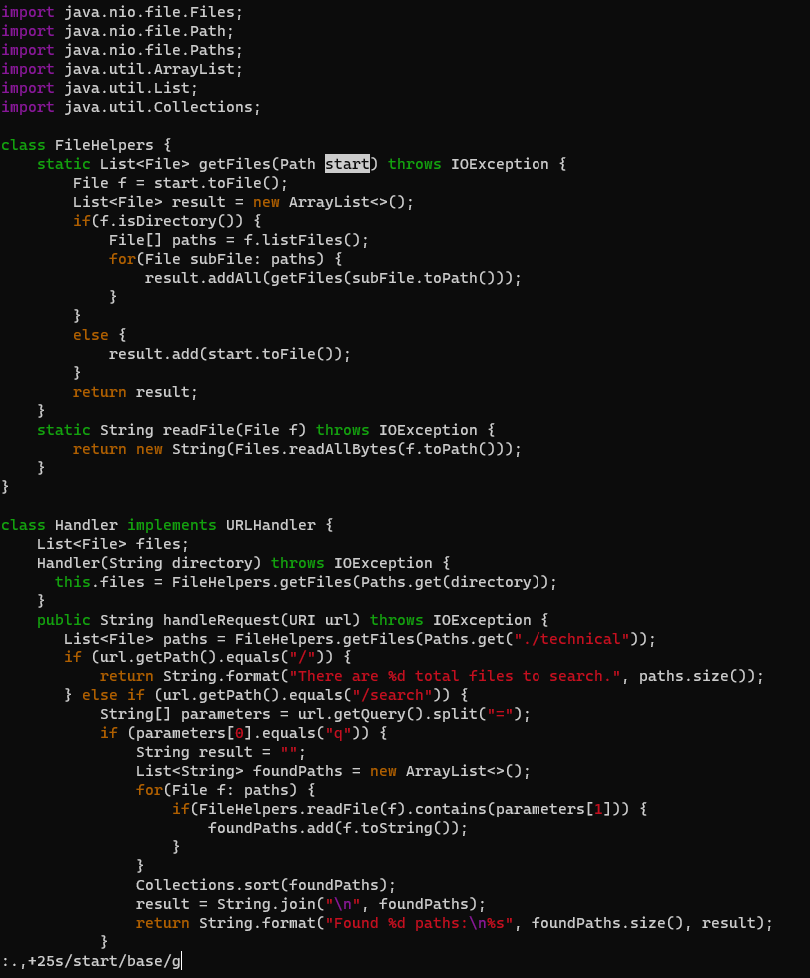

# Week 7 - Lab Report 4 
## Vim 

***Part 1:***
Changing the name of the start parameter and its uses to base

This above can be done using the following command:

`:.,+25s/start/base/g<Enter>:w<Enter>`

This command goes from the current line to 25 lines from that line and changes every instance of start to base on each line, and saves it.

Before: `:.,+25s/start/base/g<Enter>`

After: `:.,+25s/start/base/g<Enter>`

After: `:w<Enter>`

***Part 2:***
Timing and Preference

*Time to make change locally:* **58.58 seconds**

*Time to make change remotely:* **51.37 seconds**

***Comments on the above methods:***
- If I were to work on a program that I was running remotely, I would use VSCode. I get to see multiple files at once, I can scroll from the beginning to the end of the file with the ease of the mouse, and I have many tools which I've been used to my entire life, like copy-pasting, and find-replacing. However I do agree that using vim can make the whole process faster, however you need to be well versed wtith vim, and all it's commands to choose it over VSCode.

- I think if it's a small project and generally an easier task when, such as minor changes that I don't want to do locally and scp, I would choose to use vim. Otherwise, I would just choose VSCode as I have used it for a long time, and I know the in's and out's of it, and love having keybaord shortcuts at my fingertips.

