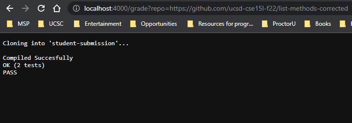
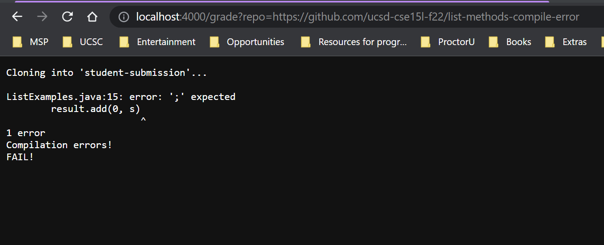
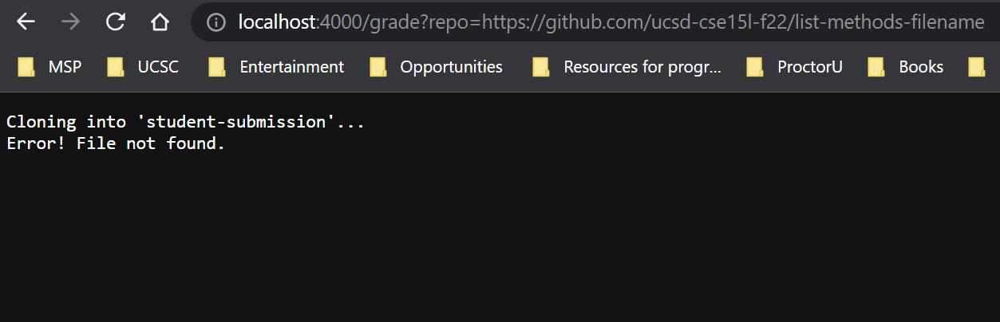

# Week 9 - Lab Report 5 
## Autograding Script

**Grade.sh:**

    set -e

    rm -rf student-submission 
    git clone $1 student-submission

    cp TestListExamples.java student-submission
    cp -r lib student-submission
    cd student-submission
    
    if [[ -e ListExamples.java ]]
    then
        echo 
    else 
        echo "Error! File not found."
        exit
    fi

    set +e

    javac -cp .:lib/hamcrest-core-1.3.jar:lib/junit-4.13.2.jar *.java
    if [[ $? -eq 0 ]]
    then
        echo "Compiled Succesfully"
        java -cp .:lib/hamcrest-core-1.3.jar:lib/junit-4.13.2.jar org.junit.runner.JUnitCore TestListExamples > output.txt
    else
        echo "Compilation errors!"
        echo "FAIL!"
        exit
    fi

    grep -e "OK" output.txt
    if [[ $? -eq 0 ]]
    then
        echo "PASS"
        java -cp .:lib/hamcrest-core-1.3.jar:lib/junit-4.13.2.jar org.junit.runner.JUnitCore TestListExamples > output.txt
    else
        grep -e "Tests run" output.txt
        echo "FAIL!"
        exit
    fi

**Running/Testing the script:**

Test 1:

Test 2:

Test 3:

**Tracing the script:**
*Script 3*

Line by line trace:

The program runs only till line 17
Line 3: No stdout and no stderr
Line 4: No stdout but stderr:

    Cloning into 'student-submission'...
    remote: Enumerating objects: 3, done.
    remote: Counting objects: 100% (3/3), done.
    remote: Compressing objects: 100% (2/2), done.

Line 5 through 17: No stdout and no stderr

remote: Total 3 (delta 0), reused 3 (delta 0), pack-reused 0
Unpacking objects: 100% (3/3), 709 bytes | 3.00 KiB/s, done.

The first if statement on line 12 return false as the file ListExamples.java isn't found in the given path. The rest of the if conditions don't run.

No lines run after line 17 because of an early exit. Lines 13 and 14 also don't run as the if statement on line 12 fails.